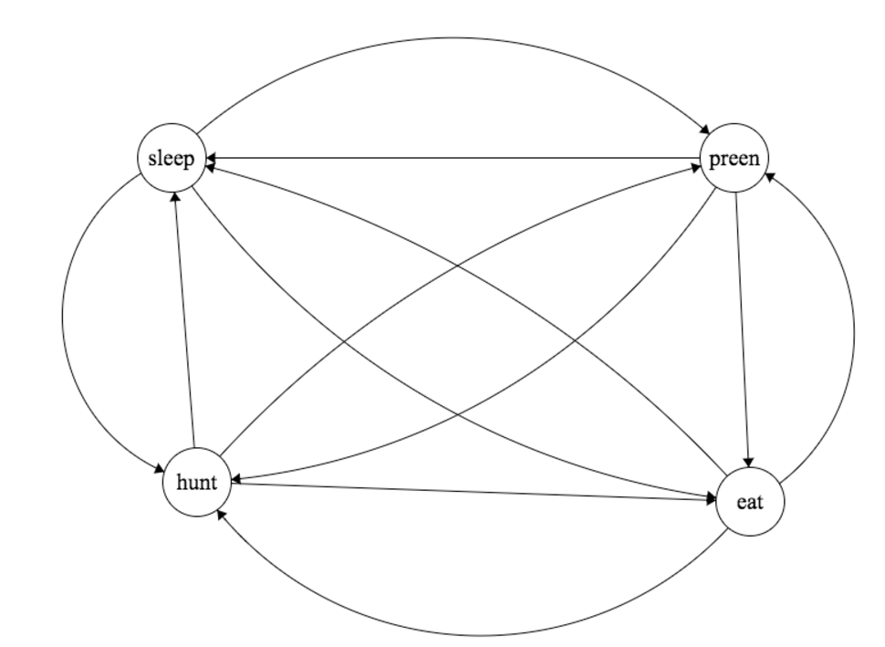
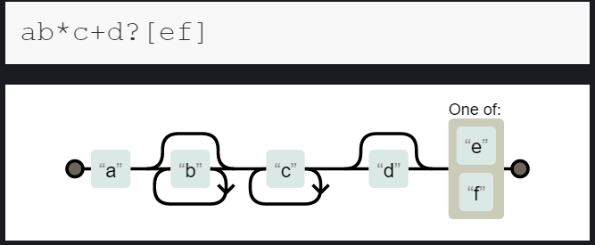
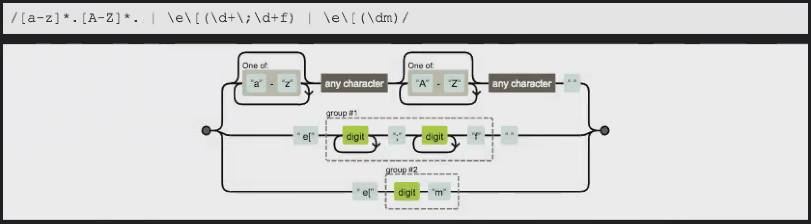


`\b(antelope)s? (rock)s? out\b[ig]`  
`\b[gm]oat\b[igm]`  
`\b(\d{1,4})\-(\d{1,2})\-(\d{1,2})*\s`  

`/\e\[(\d+\;\d+f)/g`  
`/\e\[(dm)/g`

`/\e\[(\d+\;\d+f)|/\e\[(dm)|[a-z]*.[A-Z]*.`

###algorithms###  
a) O(n)  
b) O(log n)  
c) O(log n)  
d) O(n log n)  
e) O(n!)  
f) O(n)  
g) O(n)   

###exercise II ###
a)
`double best = 0.0;
double min = a[0];  
for (int i = 0; i < N; i++) {  
    min = Math.min(a[i], min);  
    best = Math.max(a[i] - min, best);  
}`

b)  
We need to minimize this worst-case number of drops. For that, we need to generalize the problem to have n floors.  
Let's assume we take some step value m initially. If every subsequent step is m-1,
then, 
`m+ m−1+ m−2+.....+ 1 = n`  which is `m∗(m+1)2=n` 

